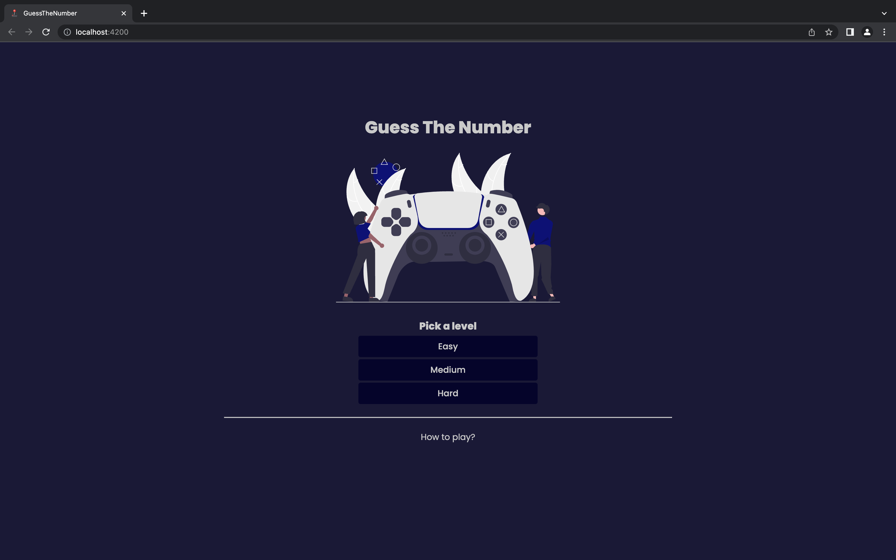
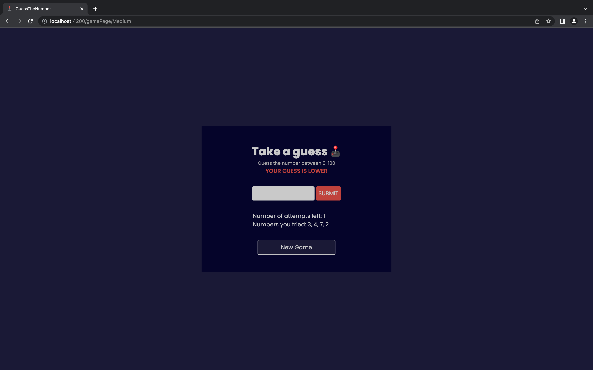

# Guess The Number

Guess The Number is a fun mini game created in Angular where the objective is to guess the randomly generated number within 5 attempts. With 3 different levels of difficulty to choose from, players can challenge themselves and test their guessing skills. 

